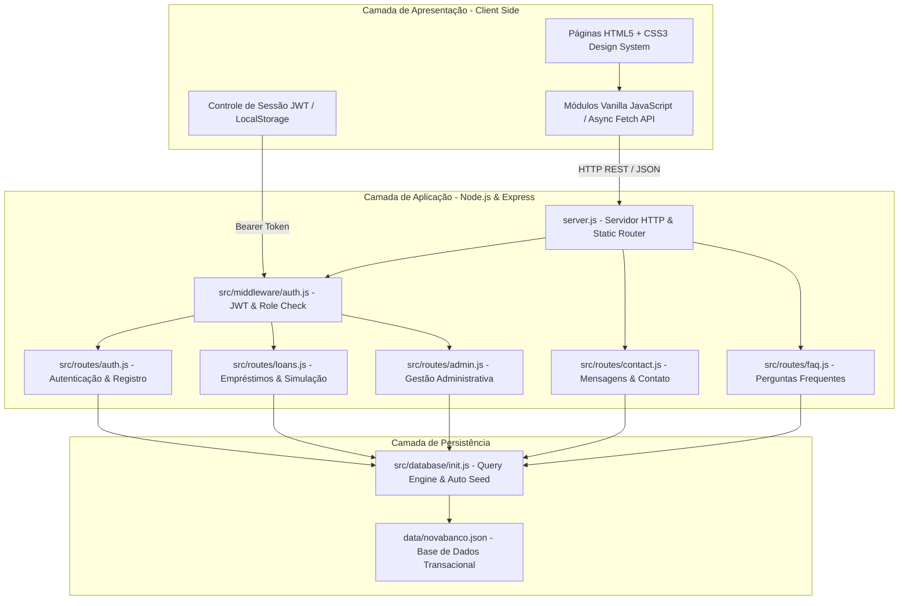

# 🏦 NovaBanco - Plataforma Bancária Digital Full-Stack

[](LICENSE)
[](https://nodejs.org)
[](https://expressjs.com)
[](https://jwt.io)
[](#-desenvolvimento-assistido-por-inteligência-artificial-ia)

O **NovaBanco** é uma aplicação web bancária completa, moderna e responsiva, desenvolvida para demonstrar um ecossistema financeiro digital com suporte a contas de clientes, simulação e contratação de empréstimos, central de suporte com FAQ interativo e um painel de controle administrativo completo.

Este projeto faz parte do repositório de práticas de código e desenvolvimento assistido por Inteligência Artificial: [AI-Assisted-codes-praticing](https://github.com/Marcos-dot1/AI-Assited-codes-praticing).

---

## 📑 Sumário

- [Visão Geral](#-visão-geral)
- [Arquitetura do Sistema](#-arquitetura-do-sistema)
- [Tecnologias Utilizadas](#-tecnologias-utilizadas)
- [Funcionalidades Principais](#-funcionalidades-principais)
- [Desenvolvimento Assistido por Inteligência Artificial (IA)](#-desenvolvimento-assistido-por-inteligência-artificial-ia)
- [Estrutura do Projeto](#-estrutura-do-projeto)
- [Instalação e Execução](#-instalação-e-execução)
- [Credenciais Padrão](#-credenciais-padrão)
- [Testes Automatizados](#-testes-automatizados)
- [Licença](#-licença)

---

## 🌟 Visão Geral

O **NovaBanco** foi projetado para oferecer uma experiência fluida tanto para clientes finais quanto para operadores da instituição financeira:

- **Para o Cliente**: Interface intuitiva para abertura de conta, visualização de extratos e saldos, contratação e simulação de empréstimos em tempo real e abertura de chamados de suporte.
- **Para a Administração**: Painel analítico com visão de métricas financeiras consolidadas, gerenciamento de base de clientes, análise/aprovação/rejeição de propostas de crédito e respostas a mensagens de contato.

---

## 🏗 Arquitetura do Sistema

A aplicação foi construída seguindo uma arquitetura em camadas desacoplada, focada em simplicidade, manutenibilidade e alta portabilidade:



### Componentes da Arquitetura:

1. **Frontend (SPA/MPA Híbrido)**:
   - Desenvolvido com HTML5 semântico, CSS3 modular (com variáveis CSS e suporte a modo escuro/gradientes modernos) e JavaScript moderno (ES6+ assíncrono).
   - Comunicação com o backend 100% baseada em chamadas REST assíncronas via `fetch`.
   - Gerenciamento de estado de autenticação via `localStorage` com controle de permissões por perfil (cliente comum vs. administrador).

2. **Backend (API RESTful em Node.js & Express)**:
   - Roteamento modular por domínio (`auth`, `loans`, `admin`, `contact`, `faq`).
   - Validações de entrada robustas usando `express-validator`.
   - Middleware de autorização centralizado para validação de tokens JWT e verificação de privilégios de administrador.
   - Criptografia unidirecional com salt dinâmico via `bcryptjs`.

3. **Camada de Dados & Persistência**:
   - Engine de persistência personalizada em `src/database/init.js`, simulando a interface de queries síncronas (`prepare`, `run`, `get`, `all`, `transaction`).
   - Persistência em arquivo JSON seguro (`data/novabanco.json`), garantindo zero dependências de compilação C++ nativa e execução imediata em qualquer sistema operacional.
   - Carga automática de sementes de dados (*seeds*): criação automática do usuário administrador e FAQ completo no primeiro boot.

---

# 💻 Tecnologias Utilizadas

### Backend
- **[Node.js](https://nodejs.org/)**: Ambiente de execução JavaScript server-side.
- **[Express.js](https://expressjs.com/)**: Framework web minimalista para construção da API REST.
- **[JSON Web Tokens (JWT)](https://jwt.io/)**: Mecanismo de autenticação stateless e seguro.
- **[Bcrypt.js](https://github.com/dcodeIO/bcrypt.js)**: Hashing seguro de senhas com salt.
- **[Express-Validator](https://express-validator.github.io/)**: Middleware de sanitização e validação de schemas de requisição.
- **[CORS](https://github.com/expressjs/cors)**: Configuração de cabeçalhos de segurança para Cross-Origin Resource Sharing.
- **[Dotenv](https://github.com/motdotla/dotenv)**: Gerenciamento seguro de variáveis de ambiente.

### Frontend
- **HTML5**: Estrutura semântica e acessível.
- **CSS3 Customizado**: Sistema de design moderno, glassmorphism, gradientes e layout responsivo (Flexbox e CSS Grid).
- **Vanilla JavaScript (ES6+)**: Lógica desacoplada de frameworks pesados, manipulação dinâmica de DOM e consumo da API REST.
- **Font Awesome & Google Fonts (Inter / Outfit)**: Ícones e tipografia moderna.

### Qualidade & Ferramentas
- **Node Test Script (`test-api.js`)**: Bateria completa de testes automatizados de integração cobrindo fluxos de autenticação, simulações, concessão de empréstimos e rotas protegidas de administração.
- **Git & GitHub**: Versionamento de código.

---

# ⚡ Funcionalidades Principais

### 👤 1. Autenticação e Gestão de Usuários
- Cadastro de novos clientes com validação estrita de dados (Nome, CPF único, E-mail único, Telefone e Senha).
- Criptografia de senhas com `bcrypt`.
- Emissão de tokens JWT com expiração configurável.
- Distinção clara entre perfis `Cliente` e `Administrador`.
- Rota para consulta e atualização dos dados do próprio perfil (`/api/auth/me`).

### 💰 2. Simulação e Solicitação de Empréstimos
- **Simulador Interativo**: Cálculo automático de parcelas, juros compostos mensais e Custo Efetivo Total (CET) em tempo real.
- **Modalidades**: Empréstimo Pessoal (taxas padrão a partir de 1,5% a.m.) e Empréstimo Consignado (a partir de 1,0% a.m.).
- **Submissão de Propostas**: Registro imediato de propostas com status inicial `pendente`.
- **Acompanhamento**: Histórico detalhado de empréstimos com status (`pendente`, `aprovado`, `rejeitado`, `pago`), valores e notas deixadas pela equipe de crédito.

### 📊 3. Dashboard do Cliente
- Visão consolidada com resumo financeiro.
- Acesso rápido a novas simulações.
- Tabela interativa de solicitações de empréstimo ativas e finalizadas.
- Central de notificações e avisos de status.

### 🛡 4. Painel Administrativo Completo
- **Métricas Globais**: Contadores de clientes ativos, total de crédito concedido, solicitações pendentes e chamados em aberto.
- **Gestão de Empréstimos**: Listagem geral de propostas com ferramentas para **Aprovar** ou **Rejeitar** solicitações, incluindo justificativas/notas administrativas.
- **Gestão de Clientes**: Visualização detalhada de todos os correntistas cadastrados.
- **Central de Atendimento**: Gerenciamento de mensagens recebidas pelo formulário de contato, com funcionalidade de resposta direta pelo administrador.

### ❓ 5. FAQ e Central de Contato
- Sistema de perguntas frequentes categorizado (Conta, Empréstimos, Segurança, Geral).
- Busca dinâmica em tempo real no FAQ com filtro instantâneo por palavras-chave.
- Formulário de contato para dúvidas, sugestões e suporte técnico.

---

# 🤖 Desenvolvimento Assistido por Inteligência Artificial (IA)

Este projeto foi construído e refinado utilizando práticas avançadas de **Desenvolvimento Assistido por IA (AI-Assisted Development)**, onde a Inteligência Artificial atuou como um parceiro de programação (*AI Pair Programmer*) e arquiteto de software.

### Como a IA foi aplicada no ciclo de desenvolvimento:

1. **Definição e Arquitetura da Solução**:
   - Auxílio na modelagem das entidades relacionais (Clientes, Empréstimos, Mensagens de Contato, FAQ) e definição dos endpoints RESTful padronizados.
   - Planejamento de fluxos de segurança baseados no padrão JWT e políticas de controle de acesso baseado em papéis (RBAC).

2. **Geração e Refatoração de Código**:
   - Escrita automatizada de rotas e controllers Express com tratamento consistente de erros e validações com `express-validator`.
   - Desenvolvimento de uma camada de abstração de banco de dados (`src/database/init.js`) com compatibilidade SQL para garantir portabilidade universal sem dependência de drivers nativos compilados em C/C++.
   - Construção dos layouts e componentes de interface (HTML/CSS/JS) com design premium, transições suaves e responsividade.

3. **Criação de Testes de Integração Automatizados**:
   - Desenvolvimento da suíte de testes de ponta a ponta em `test-api.js`, cobrindo:
     - Registro e login de usuários normais e administradores;
     - Bloqueio de acessos não autorizados em rotas privadas;
     - Simulação, criação, aprovação e rejeição de empréstimos;
     - Envio e resposta de mensagens de contato.

---

## 📁 Estrutura do Projeto

```plaintext
Bank-project/
├── data/                       # Arquivo de persistência da aplicação
│   └── novabanco.json          # Base de dados em formato JSON (auto-gerada)
├── public/                     # Camada de Frontend (Arquivos estáticos)
│   ├── css/
│   │   ├── style.css           # Estilização global, layout base e landing page
│   │   └── pages.css           # Estilos das páginas internas (Dashboard, Admin, etc.)
│   ├── js/
│   │   ├── admin.js            # Lógica e renderização do painel administrativo
│   │   ├── auth.js             # Gerenciador de autenticação, login e registro
│   │   ├── dashboard.js        # Lógica do painel do cliente
│   │   ├── loans.js            # Simulador e formulário de contratação de empréstimos
│   │   └── main.js             # Scripts da landing page, FAQ e contato
│   ├── admin.html              # Página do painel administrativo
│   ├── dashboard.html          # Página do painel do cliente
│   ├── index.html              # Landing page principal
│   ├── loans.html              # Página de empréstimos e simulador
│   ├── login.html              # Página de login
│   └── register.html           # Página de abertura de conta
├── src/                        # Camada de Backend (Node.js & Express)
│   ├── database/
│   │   └── init.js             # Engine de dados e scripts de inicialização/seed
│   ├── middleware/
│   │   └── auth.js             # Middlewares de validação JWT e verificação de admin
│   └── routes/
│       ├── admin.js            # Rotas da API administrativa
│       ├── auth.js             # Rotas de cadastro, login e perfil
│       ├── contact.js          # Rotas de envio e listagem de mensagens
│       ├── faq.js              # Rotas de consulta e busca do FAQ
│       └── loans.js            # Rotas de cálculo, submissão e consulta de empréstimos
├── .env                        # Variáveis de ambiente
├── .gitignore                  # Arquivos ignorados pelo Git
├── LICENSE                     # Licença MIT
├── package.json                # Manifesto do projeto e dependências npm
├── server.js                   # Ponto de entrada do servidor Express
├── test-api.js                 # Script de testes automatizados da API
└── README.md                   # Documentação do projeto
```

---

# 🚀 Instalação e Execução

### Pré-requisitos
- [Node.js](https://nodejs.org/) versão 18.x ou superior instalada.
- Gerenciador de pacotes `npm`.

### Passo a Passo

1. **Clone o repositório:**
   ```bash
   git clone https://github.com/Marcos-dot1/AI-Assited-codes-praticing.git
   cd AI-Assited-codes-praticing
   ```

2. **Instale as dependências:**
   ```bash
   npm install
   ```

3. **Configure as variáveis de ambiente (Opcional):**
   O projeto já inclui um arquivo `.env` padrão configurado:
   ```env
   PORT=3000
   JWT_SECRET=novabanco_super_secret_key_2026_change_in_production
   JWT_EXPIRES_IN=7d
   ```

4. **Inicie o servidor:**
   ```bash
   npm start
   ```
   *Ou para desenvolvimento:*
   ```bash
   npm run dev
   ```

5. **Acesse a aplicação no navegador:**
   Abra [http://localhost:3000](http://localhost:3000)

---

# 🔑 Credenciais Padrão

Ao inicializar o banco de dados pela primeira vez, uma conta administrativa padrão é criada automaticamente:

| Perfil | E-mail | Senha |
| :--- | :--- | :--- |
| **Administrador** | `admin@novabanco.com` | `admin123` |
| **Cliente** | *Crie uma nova conta em "Abrir Conta" ou utilize o formulário de cadastro.* | Definida no cadastro |

---

# 🧪 Testes Automatizados

O projeto conta com um script completo de validação de rotas e regras de negócio. Com o servidor rodando em background (ou executando o teste diretamente), execute:

```bash
node test-api.js
```

O teste irá executar e validar em sequência:
- Health check da API;
- Criação e autenticação de usuário;
- Validação de formato de CPF e unicidade de e-mail;
- Simulação de empréstimo e validação matemática de parcelas;
- Submissão de propostas de crédito;
- Verificação de proteção das rotas de admin;
- Aprovação de propostas com conta administrativa.

---

# 📄 Licença

Este projeto está sob a licença [MIT](LICENSE). Sinta-se livre para estudar, modificar e utilizar o código para fins educacionais e de aprendizado.
